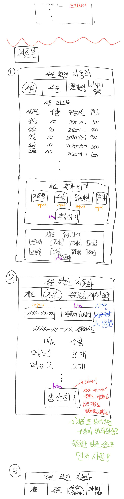
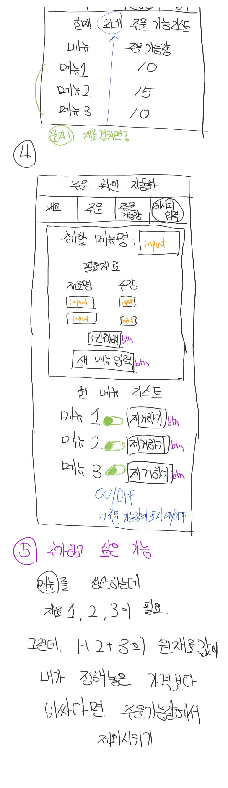

# 이것이 제목이다.

이제부터 글을 쓰면 이것은 본문입니다.

여러줄을 띄어도 그냥 무시됩니다.

그냥 줄바꿈을 해서 쓰면  
옆에 붙어 버립니다.  
이럴때는 스페이스 2개를 쓰면 됩니다.

1. 목록 번호
2. 번호2
3. 번호3

- 번호없는 목록
- 다음 목록
- 다음 목록

링크
[링크텍스트](http://www.google.com)

이미지는  


---

## 기획안

이 서비스는 `레시피`와 `재료`를 관리하는 **서비스**입니다.

```python
def helo():
    print("Hello World")
```

  


### 3번째 제목

#### 4번째 제목
